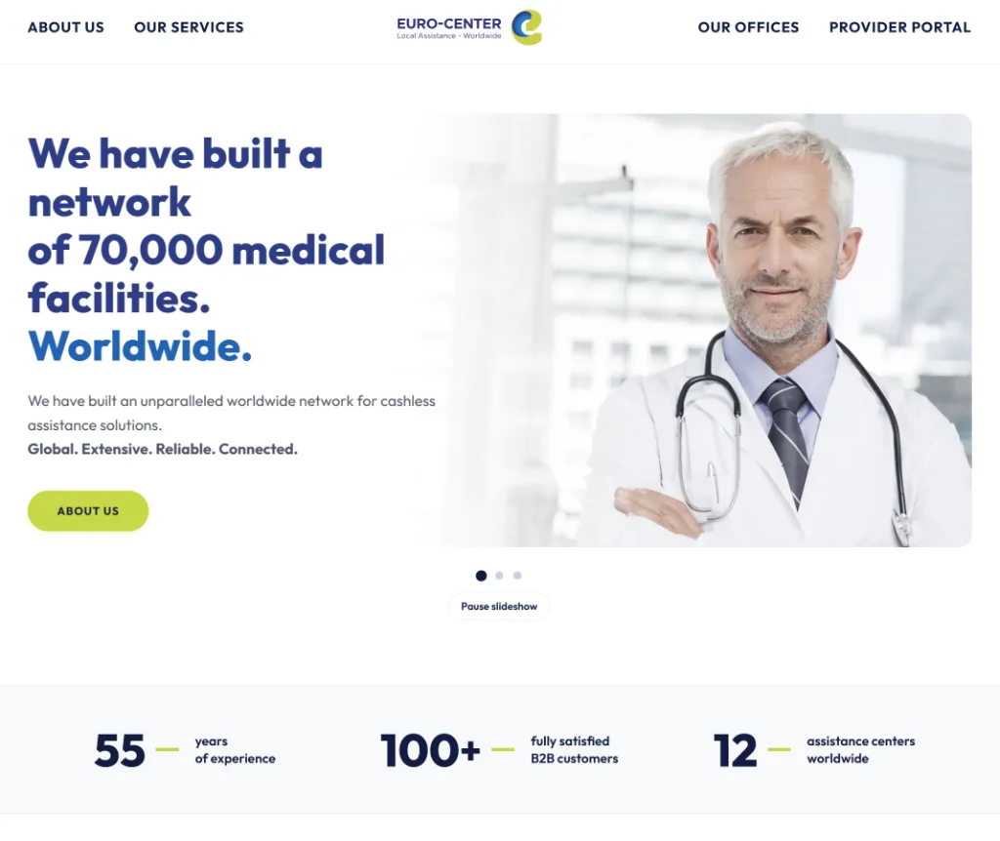
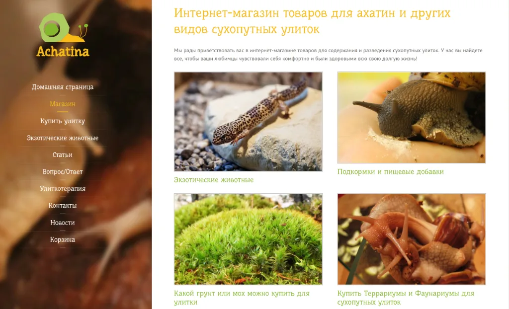

# Aleš Janáček — Personal Portfolio & CV

Personal website and curriculum vitae of **Aleš Janáček**, Frontend Developer with 6+ years of commercial experience in modern web applications, enterprise business automation, modern JavaScript, and the **Astro** framework. Based in Prague, Czech Republic.

---

## 🚀 Live Website & Resume
- **Interactive Portfolio & CV:** **[svitovan.github.io](https://svitovan.github.io)**
- **Direct Download (ATS-Friendly PDF):** **[CV-Ales-Janacek.pdf](https://svitovan.github.io/CV-Ales-Janacek.pdf)**
- **Markdown Version:** **[CV-Ales-Janacek.md](CV-Ales-Janacek.md)**

## 🛠️ Core Competencies & Tech Stack
- **Frontend Core:** Modern JavaScript (ES6+), Astro, HTML5, CSS3, Tailwind CSS, WordPress
- **Active Learning / Expanding:** React, TypeScript
- **Backend & Integrations:** REST APIs, SQL, SharePoint, Power Automate
- **DevOps, Cloud & Infrastructure:** Microsoft Azure (Azure Repos, Azure Pipelines, Azure Static Web Apps), Docker (secured DMZ perimeter), Linux, Bash, Git, PowerShell
- **AI-Assisted Engineering:** LLM workflows, automated scripting, agentic prototyping

## 🌟 Key Highlights
- **Corporate Cloud Modernization:** Migrated the corporate website ([Euro-Center Holding SE](https://www.euro-center.com)) to **Astro**, with source control in **Azure Repos** and automated deployment through **Azure Pipelines** to **Azure Static Web Apps**; achieved PageSpeed Insights scores of **98 Performance**, **97 Accessibility**, **96 Best Practices**, and **100 SEO**.
- **Docker & Infrastructure:** Containerized legacy corporate WordPress platform with **Docker** on a dedicated Linux server within a secured **DMZ** environment, ensuring 99.9% uptime and smooth server migrations.
- **Enterprise Solutions:** Developed a SharePoint-based Global Inventory System adopted across 12 international offices.
- **Workflow Automation:** Automated core business and onboarding workflows via Power Automate and custom interfaces.
- **Specialized E-Commerce Platform:** Engineered a responsive B2C e-shop ([Achatina](https://www.achatina.com.ua)) for an exotic pet breeding business, featuring dynamic species catalog filtering, rich media lightbox galleries, and custom order inquiry workflows.
- **Executive Leadership Foundation:** Prior background as Chief Executive at Auction House Kleynod and municipal project coordinator at KCCA for UEFA Euro 2012 staging, bringing mature business ownership and cross-functional leadership.

## 🖥️ Featured Project Showcases

<table>
  <tr>
    <td width="50%" align="center">
      <strong><a href="https://www.euro-center.com">Euro-Center Holding SE</a></strong> 
      Corporate Cloud Modernization · Astro · Azure  
      
    </td>
    <td width="50%" align="center">
      <strong><a href="https://www.achatina.com.ua">Achatina E-Commerce Store</a></strong> 
      Specialized B2C E-Commerce Platform · Catalog &amp; Cart  
      
    </td>
  </tr>
</table>

## ⚡ Engineering & Architecture Features
- **Responsive WebP Image Delivery:** Hero avatar served in high-performance WebP (`red-176.webp`, `red-352.webp` with 1x/2x `srcset`) alongside optimized JPEG fallbacks, with `<link rel="preload">` and `fetchpriority="high"` for instantaneous LCP.
- **Dark Mode Engine:** Seamless manual theme switcher with SVG Sun/Moon animations, system preference auto-detection (`prefers-color-scheme`), `localStorage` persistence, and zero FOUC early boot script.
- **Interactive macOS-Style Browser Mockups:** Native CSS project previews showcasing live corporate metrics and performance pills.
- **Linked Data Graph (Schema.org JSON-LD):** Interconnected semantic entities (`WebSite`, `ProfilePage`, `ImageObject`, `Person`, `Occupation`, `alumniOf`, `CreativeWork`) conforming to Google Search Central standards.
- **Automated CI/CD Quality Gate:** GitHub Actions workflow validating schema integrity, asset availability, and link health on every push.

## 📬 Contact
- **Email:** [jana4ek@gmail.com](mailto:jana4ek@gmail.com)
- **Phone:** +420 776 677 173
- **LinkedIn:** [linkedin.com/in/ajanacek](https://www.linkedin.com/in/ajanacek/)
- **GitHub:** [@Svitovan](https://github.com/Svitovan)
